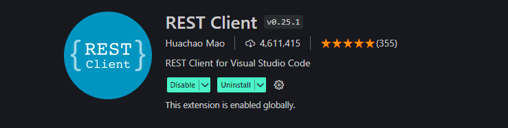
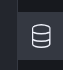
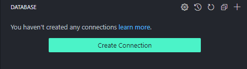
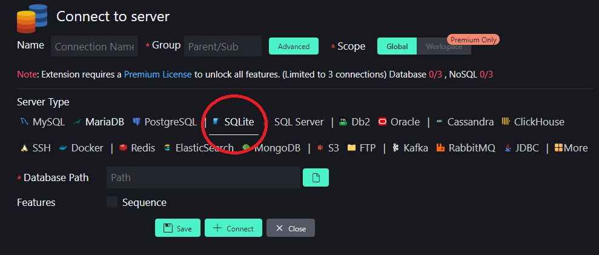
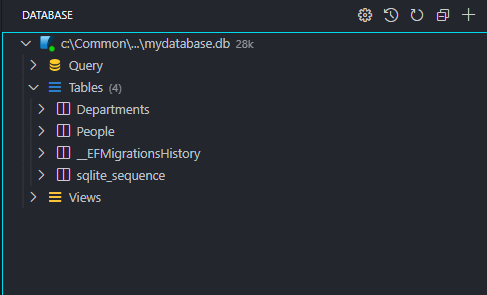
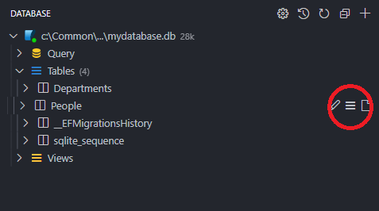
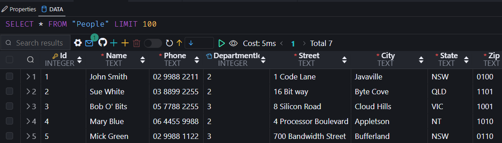

# API Usage (MSSQL EXPRESS version)

## 1. Install Microsoft dot.net SDK

- [Download .NET](https://dotnet.microsoft.com/en-us/download/dotnet)

## 2. Install Visual Studio Code

- [Download vscode](https://code.visualstudio.com/download)

## 3. Download C# Dev Kit Extensions

- [C# Dev Kit Extensions](https://marketplace.visualstudio.com/items?itemName=ms-dotnettools.csdevkit)

## 4. Download dot.net tool ef

- [Entity Framework Core tools reference](https://learn.microsoft.com/en-us/ef/core/cli/dotnet)

Install `dotnet-ef` globally

```bash
dotnet tool install --global dotnet-ef
```

List globally installed dotnet tools

```bash
dotnet tool list -g
```

## 5. MSSQL EXPRESS Database installed

## 6. Clone the repo

To clone the repository, use the following command:

```bash
git clone <repository_url>
```

Replace <repository_url> with the URL of the repository.

## 7. Restore packages

To ensure that all packages are restored before running the application, you can explicitly run the following command after cloning:

```bash
dotnet restore
```

## 8. Updating `appsettings.json`

After cloning the repository, navigate to the project directory and update the appsettings.json file to include the following connection string under the "ConnectionStrings" section:

```json
{
  "ConnectionStrings": {
    "DefaultConnection": "Server=(localdb)\\MSSQLLocalDB;Database=roi_database;Trusted_Connection=True;"
  }
}
```

Replace "Database=roi_database with your desired database name.

## 9. Creating the Database

Once the appsettings.json file is updated, run the following commands to create the database:

```bash
dotnet ef database update
```

## 10. Run the API

```bash
dotnet run
```

> After running the program, check the **IP address** of the server and update the `.http` file variable accordingly.
>
> This project ip address is configured in `/Properties/launchSettings.json`  as `http://localhost:5095`


## 11. Extra

### Update the database in case of code changes

If you make changes to the code that affect the database schema, you may need to delete existing migrations and update the database. To do this, follow these steps:

```bash
dotnet ef database drop --force             # 1. Delete existing database
dotnet ef migrations remove                 # 2. Delete existing migrations
dotnet ef migrations add InitialCreate      # 3. Generate a new initial migration
dotnet ef database update                   # 4. Update the database with the new migration
```

These commands will remove existing migrations, generate a new initial migration based on the current state of the models, and apply the migration to update the database accordingly.

### Drop and Create new database

```bash
dotnet ef database drop --force
dotnet ef database update
```

### Create new project

```bash
dotnet new webapi  -minimal
```

### Add Packages

```bash
dotnet add package Microsoft.EntityFrameworkCore.SqlServer
dotnet add package Microsoft.EntityFrameworkCore.Tools
dotnet add package Microsoft.VisualStudio.Web.CodeGeneration.Design
```

### Installing REST Client Extension in VSCode

To install the REST Client extension in Visual Studio Code (VSCode), follow these steps:

1. Open VSCode.
2. Go to the Extensions view by clicking on the Extensions icon in the Sidebar or pressing `Ctrl+Shift+X`.
3. Search for "REST Client" in the Extensions Marketplace.
4. Click on the "Install" button next to the REST Client extension.



### Using .http file to Test the API

The `.http` file provides a convenient way to test the API endpoints using the REST Client extension in VSCode.

### Understanding Variables

The `.http` file may contain variables defined at the beginning of the file, such as:

```javascript
@HostAddress = http://localhost:5095
```

This variable `@HostAddress` represents the base URL of the ROI API. You can modify it to match the actual base URL of your API.

### Sending Requests

To send requests using the `.http` file, follow these steps:

1. Open the `.http` file in VSCode.
2. Ensure that the REST Client extension is installed.
3. Modify the base URL variable `@HostAddress` if needed.
4. Click on the "**Send Request**" button that appears over each request in the file to execute the request.


### Installing SQl Server Client(mssql) Extension in VSCode

To install the SQl Server Client(mssql) extension in Visual Studio Code (VSCode), follow these steps:

1. Open VSCode.
2. Go to the Extensions view by clicking on the Extensions icon in the Sidebar or pressing `Ctrl+Shift+X`.
3. Search for "SQl Server Client(mssql)" in the Extensions Marketplace.
4. Click on the "Install" button next to the SQl Server Client(mssql) extension.


### Connect to SQLite database using SQl Server Client(mssql) Extension

- From the activities bar in vscode select database icon



- click on Create Connection button



- You will see the following from, select SQLite database



- In the Database Path select the path to the SQLite database the exists in the same folder of the API, ans press on Connect button

- You will see the content of the database in the explorer pan



- Select the table and click on the right icon to display the content of the table



- You can see the content of the table (People table)


